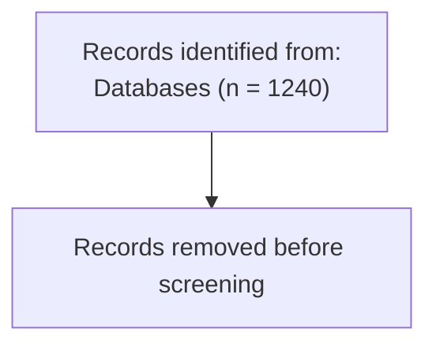

`prisma-flow` renders through a small intermediate layout representation:

```text
PrismaFlow
  -> template builder
  -> DiagramLayout
  -> renderer
```

## SVG

SVG is the default renderer and is implemented in pure Python.

```python
svg = flow.to_svg()
flow.to_svg("prisma.svg")
```

The SVG renderer supports:

- rectangles
- arrows
- side boxes
- wrapped multiline text
- escaped user text
- embedded CSS
- accessibility title and description

## HTML

HTML output embeds the generated SVG in a standalone document.

```python
flow.to_html("prisma.html")
```

## Mermaid

Mermaid output is text only. `prisma-flow` does not call Mermaid CLI.

```python
flow.to_mermaid("prisma.mmd")
```

Example output:



## PNG

PNG export is optional and intentionally not part of the required rendering
stack in v0.1. If requested without an available backend, the package raises an
`OptionalDependencyError` with installation guidance.
