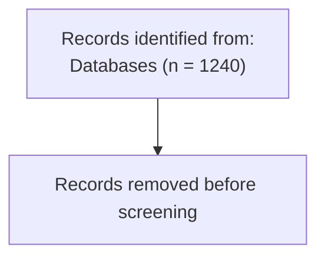

`prisma-flow` renders through a small intermediate layout representation:

```text
PrismaFlow
  -> template builder
  -> DiagramLayout
  -> renderer
```

## SVG

SVG is the default renderer and is implemented in pure Python.

```python
svg = flow.to_svg()
flow.to_svg("prisma.svg")
```

The SVG renderer supports:

- rectangles
- arrows
- side boxes
- PRISMA 2020-style header and stage labels
- expanded other-methods layout when other-method counts are present
- wrapped multiline text
- escaped user text
- embedded CSS
- accessibility title and description

## Notebook display

`PrismaFlow` implements the Jupyter rich display protocol directly. In notebook
frontends, evaluate a flow object as the last expression in a cell to display
the SVG diagram inline:

```python
from prismaflow import new_review

flow = new_review(...)
flow
```

This uses SVG MIME output and does not require `prisma-flow` to depend on
Jupyter or IPython.

## HTML

HTML output embeds the generated SVG in a standalone document.

```python
flow.to_html("prisma.html")
```

## Mermaid

Mermaid output is text only. `prisma-flow` does not call Mermaid CLI.

```python
flow.to_mermaid("prisma.mmd")
```

Example output:



## PNG

PNG export is included in the base install and rasterizes the generated SVG
through the pip-installable `resvg` Python backend:

```python
png = flow.to_png()
flow.to_png("prisma.png")
```

The PNG renderer does not require Graphviz, Cairo, a browser engine, Node, or
Mermaid CLI. Minimal notebook environments may not include fonts; if PNG output
has boxes but no text, install a basic font package such as `fonts-dejavu-core`
before rendering.
